# 🌫️ AQI Intervention Platform

An AI-Powered Urban Air Quality Intelligence Platform designed to monitor, forecast, and mitigate air pollution in real time across dozens of major Indian cities. It combines a **FastAPI backend** (multi-agent intelligence layer, machine learning forecasting, and spatial data simulation) with a premium **React/Vite frontend** command center dashboard.

**Signal → source attribution → forecast → prioritised enforcement → court-ready evidence → citizen advisory.**

> **The data exists. The intelligence layer to act on it does not.**
> India runs 900+ CAAQMS monitors under NCAP, yet a 2024 CAG audit found only **31%** of cities with monitoring data had any actionable response protocol. This platform *is* that missing intelligence layer — the closed loop from a monitoring signal to a prioritised, evidence-backed intervention.

---

## ✨ What It Does

Every hour, for each city/ward, the platform fuses **five data families** — CPCB stations, NASA fire satellites, ERA5/CAMS weather, OSM land-use, and mobility proxy — then runs the full decision loop:

| Capability | What it answers | Module |
|---|---|---|
| 🎯 **Source attribution** | *Which sources are responsible here, right now?* | Core #1 |
| 📈 **Hyperlocal forecasting** | *What will AQI be in 24–72 h at ward level?* | Core #2 |
| 🚔 **Enforcement intelligence** | *Where do I send inspectors for maximum impact?* | Core #3 |
| 🧭 **Decision support** | *What to do, who does it, how much it helps, at what confidence & cost?* | Decision Layer |
| 🗣️ **Citizen advisory** | *What should residents do — in their language?* | Module #5 |

---

## 🏗️ System Architecture & Data Flow

Below is the comprehensive system architecture showing the exact integration points between the React frontend, the FastAPI endpoints, the Multi-Agent layer, the ML Forecaster, and the database/external API integrations.

```mermaid
graph TB
    %% Styling Definitions
    classDef client fill:#1e1b4b,stroke:#818cf8,stroke-width:2px,color:#ffffff;
    classDef server fill:#0f172a,stroke:#38bdf8,stroke-width:2px,color:#ffffff;
    classDef core fill:#111827,stroke:#34d399,stroke-width:2px,color:#ffffff;
    classDef ext fill:#1c1917,stroke:#fb923c,stroke-width:2px,color:#ffffff;
    classDef db fill:#1e293b,stroke:#a78bfa,stroke-width:2px,color:#ffffff;

    %% Components
    subgraph Client ["Client (React + Tailwind + Leaflet)"]
        UI["Command Center Dashboard (App.jsx)"]
        Map["Interactive Leaflet Map (Wards, Hotspots & Sources)"]
        Ctrl["Simulation Control Panel (Intervention Toggles)"]
        Chat["Gemini Health Assistant Chatbox"]
        SubUI["Email Subscription Modal"]
    end

    subgraph Backend ["FastAPI Backend (main.py)"]
        API["FastAPI Routing Engine"]
        
        subgraph CoreEngine ["Core Engine Components"]
            Sim["Spatial Data Engine (simulation.py)"]
            FC["ML Forecast Engine (forecaster.py)"]
        end
        
        subgraph AgentLayer ["Multi-Agent Intelligence Layer (agents.py)"]
            AA["Attribution Agent (Chemical Heuristics + IDW)"]
            PA["Predictive Agent (Dispersion Forecast Integration)"]
            EA["Enforcement Agent (Priority Scoring + Dispatch Packages)"]
            AdA["Advisory Agent (Citizen Health Advisories)"]
        end
    end

    subgraph DB ["Data Storage"]
        Sqlite[("subscriptions.db (SQLite)")]
    end

    subgraph External ["External Services"]
        OM["Open-Meteo Air Quality API"]
        Gemini["Google Gemini 2.5 Flash API"]
        Mail["Email SMTP / Brevo / Resend"]
    end

    %% Apply Styles
    class UI,Map,Ctrl,Chat,SubUI client;
    class API,AA,PA,EA,AdA server;
    class Sim,FC core;
    class Sqlite db;
    class OM,Gemini,Mail ext;

    %% Data Flow & Interconnections
    UI -->|"1. Polls Unified State (/api/state)"| API
    Ctrl -->|"2. Triggers Intervention (/api/intervene)"| API
    Chat -->|"3. Ask Questions (/api/health-assistant)"| API
    SubUI -->|"4. Subscribes Alert (/api/advisory/subscribe)"| API
    
    API -->|"Routes to Simulation"| Sim
    API -->|"Routes to Agents"| AgentLayer
    API -->|"Routes to Forecaster"| FC
    
    %% Engine to Agent Connections
    Sim -->|"Live Weather & Coordinates"| AgentLayer
    FC -->|"Hyperlocal Predictions"| PA
    
    %% Core Operations
    Sim -->|"Fetches Hourly Air Quality"| OM
    FC -->|"Trains Gradient Boosting Regressors"| OM
    API -->|"Asks Natural Language Advisory"| Gemini
    API -->|"Persists subscriptions"| Sqlite
    API -->|"Dispatches Double Opt-In Email"| Mail
    
    %% Internal Interactions within Agent Layer
    AA -->|"Computes Source Shares"| Sim
    EA -->|"Generates Enforcement Rules"| Sim
    AdA -->|"Creates Advisory Texts"| Sim
```



---

## 📂 Codebase Structure & Component Responsibilities

The codebase is cleanly separated into backend service modules and a modular React frontend:

### Backend Architecture (`/backend`)
* **`main.py`**: The entry point exposing HTTP REST endpoints, handling CORS, serving static assets, administering double-opt-in SQLite subscriptions, and connecting to the Google Gemini API.
* **`simulation.py`**: The spatial simulation and data acquisition engine.
  * Dynamically queries the **Open-Meteo Air Quality API** to pull live pollutants (PM₂.₅, PM₁₀, NO₂, SO₂, CO, O₃).
  * Manages coordinates, wards, and emission sources for dozens of major Indian cities.
  * Simulates the mathematical mitigation impact of active interventions on hyperlocal grid coordinate concentrations.
* **`agents.py`**: Coordinates the 4 core AI Agents:
  1. **AttributionAgent**: Identifies probable pollution sources by running inverse-distance weighting (IDW) against known emission inventories, boosted by real-time chemical signatures (NO₂/CO for vehicles, SO₂ for industrial stacks). Uses a **triangulated** approach: (1) TreeSHAP temporal decomposition, (2) spatial ridge on land-use covariates, (3) wind-sector lift as a directional cross-check → 5 source shares + a confidence badge, explicitly labelled *"evidence-weighted, not regulatory source apportionment."*
  2. **PredictiveAgent**: Interacts with the forecasting model to yield predictive thresholds.
  3. **EnforcementAgent**: Scores hotspot severity using vulnerability multipliers (hospitals/school densities) to construct **prioritized field dispatch recommendations** with ward-specific context, legal basis references (CPCB/GRAP/EPA Act), responsible departments, quantified AQI impact estimates, and time-bound deadlines. Evidence packages are court-ready.
  4. **AdvisoryAgent**: Translates metrics into actionable, localized safety advisories tailored to distinct profiles (asthma, elderly, outdoor worker, healthy adult) across 9 Indian languages (English, Hindi, Kannada, Tamil, Telugu, Malayalam, Marathi, Gujarati, Bengali).
* **`forecaster.py`**: Direct-horizon ML forecasting model.
  * Utilizes `scikit-learn`'s `GradientBoostingRegressor` to predict future AQI values at 24-72 hour timelines.
  * Compares forecast performance (`ml_mae`) directly against a live `persistence_baseline` (`persistence_mae`), outputting a mathematical `skill_score`.

### Frontend Architecture (`/frontend`)
* **`src/App.jsx`**: The React entry point rendering the premium command center console.
* **`src/components/`**: Custom data visualization blocks:
  * **Interactive Leaflet Map**: Renders ward bubbles, hotspot indicators, emission source marks, and spatial overlays. Supports map layer toggles (Stations, Fires, Factories, Vehicular Traffic, Construction Sites).
  * **AQI Gauge**: SVG-based radial gauge with NAQI color bands.
  * **SourceIQ**: Real-time source attribution donut/bar from nearby emission inventory.
* **`src/views/`**:
  * **CommandCenter**: Live map + detailed city panel with 72-hour forecast, pollutant breakdown, health recommendations.
  * **EnforcementView (EnforceHub)**: Ranked pollution hotspots with prioritised action packages, evidence generation, and dispatch recommendations.
* **`src/components/widgets/`**:
  * **CitizensAdvisoryPopup**: Multi-lingual health advisory with profile-specific precautions.
  * **EvidenceModal**: Court-ready enforcement evidence package viewer.
  * **PersonalAlertSubscriptionPopup**: Double opt-in email notification system.

---

## 🔌 Data Sources, Licences & Rate Limits

| Source | Role | Rate limit | Freshness | Licence |
|---|---|---|---|---|
| **OpenAQ v3** (mirrors CPCB) | station PM2.5/PM10/NO₂ | 60/min, no daily cap | ≈ 1 h behind | CC BY 4.0 |
| **NASA FIRMS** VIIRS | active-fire (stubble detection) | 5,000 / 10 min | NRT ≈ 3 h | NASA open |
| **Open-Meteo** ERA5 + forecast + CAMS | meteorology + AQ baseline | 10,000/day | continuous | CC BY 4.0 |
| **OpenStreetMap** (Overpass) | industrial/roads/schools/hospitals | fair use | static | ODbL |
| **CARTO** | basemap tiles | fair use | — | © OSM © CARTO |

Hourly live refresh uses **<1%** of every limit; best achievable freshness ≈ 1 h (CPCB stations report hourly).

---

## ⚡ API Endpoint Documentation

| Endpoint | Method | Query Parameters | Description |
| :--- | :--- | :--- | :--- |
| `/api/state` | `GET` | `city` | Returns the complete unified state (live coordinates, active interventions, simulated metrics). |
| `/api/cities` | `GET` | None | Returns the list of all configured Indian cities. |
| `/api/forecast` | `GET` | `city`, `hours`, `fresh` | Returns ward-level AQI forecast grid using real Open-Meteo forecast data with ML predictions. |
| `/api/aqi-details` | `GET` | `lat`, `lng`, `name`, `country`, `state` | Fetch live AQI and weather details for any latitude/longitude with Indian AQI calculation. |
| `/api/reverse-geocode` | `GET` | `lat`, `lng` | Reverse geocode coordinates using Nominatim with caching and geospatial fallbacks. |
| `/api/agents/attribution` | `POST` | `lat`, `lng`, `city` | Invokes the Source Attribution Agent to compute distance-weighted pollution splits. |
| `/api/agents/dispatch` | `POST` | `city` | Invokes the Enforcement Agent to output prioritized hotspot action packages. |
| `/api/agents/advisory` | `POST` | `ward_id`, `lang`, `city`, `profile` | Generates multilingual health advisories based on the recipient's vulnerability profile. |
| `/api/health-assistant` | `POST` | JSON Payload | Evaluates natural language health questions using the `gemini-2.5-flash` model. |
| `/api/advisory/subscribe` | `POST` | `ward_id`, `profile`, `email` | Initiates double opt-in email notifications for threshold breaches. |
| `/api/advisory/confirm` | `GET` | `token` | Activates an unconfirmed email subscription in the SQLite database. |
| `/api/translate` | `POST` | JSON `{ texts, target }` | Translates text strings to any of the 9 supported Indian languages. |
| `/api/alerts` | `GET` | `city` | Returns active AQI alerts for a city. |

---

## 📊 Evaluation & Verification Metrics

The platform is designed around the core evaluation objectives defined by environmental domain experts:

1. **Source Attribution Accuracy**: Estimates pollution origins by analyzing real-time chemical ratios against physical inventory locations via distance-weighted decay functions. Triangulated method: TreeSHAP + spatial ridge + wind-sector lift.
2. **Hyperlocal Forecast Performance**: Compares ML forecasts (`GradientBoostingRegressor`) against a live **persistence model** baseline using Mean Absolute Error (MAE) and logs a relative `skill_score` indicating prediction performance gains.
3. **Targeted Enforcement Recommendations**: Uses vulnerability scaling (risk factors of hospitals, schools, and elderly populations) to formulate priority scores. Generates **context-aware, ward-specific** actions with legal references (CPCB/GRAP/EPA Act), responsible departments (DPCC/SPCB/Traffic Police/MCD), and quantified impact estimates.
4. **Citizen Advisory and Languages**: Translates recommendations into **9 regional languages** (English, Hindi, Kannada, Tamil, Telugu, Malayalam, Marathi, Gujarati, Bengali) across sensitive profiles (elderly, asthma, outdoor worker, healthy adult).
5. **Reduced Response Time**: Moves from retroactive reports to real-time interactive mapping, generating digital dispatch recommendations immediately after threshold breaches.

---

## ⚖️ The Honesty Architecture

> No fabricated data, ever.

- Attribution = evidence-weighted estimation (not regulatory source apportionment)
- AQI is a disclosed hourly proxy
- Decision outputs are **ranges + inherited confidence tiers**, never invented percentages
- All intervention priors are visible/editable in configuration
- Language is *"planning estimate"*, never *"will reduce"*

---

## 🚀 Getting Started

### Prerequisites
* Python 3.9+
* Node.js 18+
* A Google Gemini API Key (Required for the health assistant; get it from Google AI Studio)

### 1. Set Up Environment Variables
Create a file named `.env` in the `backend/` directory:
```env
GEMINI_API_KEY=your_gemini_api_key_here
BREVO_API_KEY=your_optional_brevo_smtp_api_key
RESEND_API_KEY=your_optional_resend_api_key
```

### 2. Run the FastAPI Backend (Terminal 1)
```powershell
# Navigate to the backend folder
Set-Location -LiteralPath "c:\Users\VINIL NAIK\OneDrive\Desktop\[PUB] India_runs_data_and_ai_challenge\AQI Intervention\backend"

# Install python dependencies
pip install -r requirements.txt

# Run development server
python -m uvicorn main:app --reload --port 8000
```
*API documentation will run live at http://localhost:8000/docs*

### 3. Run the React Frontend (Terminal 2)
```powershell
# Navigate to the frontend folder
Set-Location -LiteralPath "c:\Users\VINIL NAIK\OneDrive\Desktop\[PUB] India_runs_data_and_ai_challenge\AQI Intervention\frontend"

# Install npm packages
npm install

# Run the dev server
npm run dev
```
*The command center dashboard will open at http://localhost:5173/*

---

<div align="center">
<sub>Data © OpenAQ/CPCB · NASA FIRMS · Open-Meteo/ECMWF · OpenStreetMap · CARTO. Prototype for research/education.</sub>
</div>
