# 🌫️ AQI Intervention Platform

An AI-Powered Urban Air Quality Intelligence Platform designed to monitor, forecast, and mitigate air pollution in real time across dozens of major Indian cities. It combines a **FastAPI backend** (multi-agent intelligence layer, machine learning forecasting, and spatial data simulation) with a premium **React/Vite frontend** command center dashboard.

---

## 🏗️ System Architecture & Data Flow

Below is the comprehensive system architecture showing the exact integration points between the React frontend, the FastAPI endpoints, the Multi-Agent layer, the ML Forecaster, and the database/external API integrations.

```mermaid
graph TB
    %% Styling Definitions
    classDef client fill:#1e1b4b,stroke:#818cf8,stroke-width:2px,color:#ffffff;
    classDef server fill:#0f172a,stroke:#38bdf8,stroke-width:2px,color:#ffffff;
    classDef core fill:#111827,stroke:#34d399,stroke-width:2px,color:#ffffff;
    classDef ext fill:#1c1917,stroke:#fb923c,stroke-width:2px,color:#ffffff;
    classDef db fill:#1e293b,stroke:#a78bfa,stroke-width:2px,color:#ffffff;

    %% Components
    subgraph Client ["Client (React + Tailwind + Leaflet)"]
        UI["Command Center Dashboard (App.jsx)"]
        Map["Interactive Leaflet Map (Wards, Hotspots & Sources)"]
        Ctrl["Simulation Control Panel (Intervention Toggles)"]
        Chat["Gemini Health Assistant Chatbox"]
        SubUI["Email Subscription Modal"]
    end

    subgraph Backend ["FastAPI Backend (main.py)"]
        API["FastAPI Routing Engine"]
        
        subgraph CoreEngine ["Core Engine Components"]
            Sim["Spatial Data Engine (simulation.py)"]
            FC["ML Forecast Engine (forecaster.py)"]
        end
        
        subgraph AgentLayer ["Multi-Agent Intelligence Layer (agents.py)"]
            AA["Attribution Agent (Chemical Heuristics + IDW)"]
            PA["Predictive Agent (Dispersion Forecast Integration)"]
            EA["Enforcement Agent (Priority Scoring + Dispatch Packages)"]
            AdA["Advisory Agent (Citizen Health Advisories)"]
        end
    end

    subgraph DB ["Data Storage"]
        Sqlite[("subscriptions.db (SQLite)")]
    end

    subgraph External ["External Services"]
        OM["Open-Meteo Air Quality API"]
        Gemini["Google Gemini 2.5 Flash API"]
        Mail["Email SMTP / Brevo / Resend"]
    end

    %% Apply Styles
    class UI,Map,Ctrl,Chat,SubUI client;
    class API,AA,PA,EA,AdA server;
    class Sim,FC core;
    class Sqlite db;
    class OM,Gemini,Mail ext;

    %% Data Flow & Interconnections
    UI -->|"1. Polls Unified State (/api/state)"| API
    Ctrl -->|"2. Triggers Intervention (/api/intervene)"| API
    Chat -->|"3. Ask Questions (/api/health-assistant)"| API
    SubUI -->|"4. Subscribes Alert (/api/advisory/subscribe)"| API
    
    API -->|"Routes to Simulation"| Sim
    API -->|"Routes to Agents"| AgentLayer
    API -->|"Routes to Forecaster"| FC
    
    %% Engine to Agent Connections
    Sim -->|"Live Weather & Coordinates"| AgentLayer
    FC -->|"Hyperlocal Predictions"| PA
    
    %% Core Operations
    Sim -->|"Fetches Hourly Air Quality"| OM
    FC -->|"Trains Gradient Boosting Regressors"| OM
    API -->|"Asks Natural Language Advisory"| Gemini
    API -->|"Persists subscriptions"| Sqlite
    API -->|"Dispatches Double Opt-In Email"| Mail
    
    %% Internal Interactions within Agent Layer
    AA -->|"Computes Source Shares"| Sim
    EA -->|"Generates Enforcement Rules"| Sim
    AdA -->|"Creates Advisory Texts"| Sim
```



---

## 📂 Codebase Structure & Component Responsibilities

The codebase is cleanly separated into backend service modules and a modular React frontend:

### Backend Architecture (`/backend`)
* **[main.py](file:///c:/Users/VINIL%20NAIK/OneDrive/Desktop/%5BPUB%5D%20India_runs_data_and_ai_challenge/AQI%20Intervention/backend/main.py)**: The entry point exposing HTTP REST endpoints, handling CORS, serving static assets, administering double-opt-in SQLite subscriptions, and connecting to the Google Gemini API.
* **[simulation.py](file:///c:/Users/VINIL%20NAIK/OneDrive/Desktop/%5BPUB%5D%20India_runs_data_and_ai_challenge/AQI%20Intervention/backend/simulation.py)**: The spatial simulation and data acquisition engine.
  * Dynamically queries the **Open-Meteo Air Quality API** to pull live pollutants ($PM_{2.5}$, $PM_{10}$, $NO_2$, $SO_2$, $CO$, $O_3$).
  * Manages coordinates, wards, and emission sources for dozens of major Indian cities.
  * Simulates the mathematical mitigation impact of active interventions (e.g. pauses in construction, traffic rotation, industrial caps, street watering) on hyperlocal grid coordinate concentrations.
* **[agents.py](file:///c:/Users/VINIL%20NAIK/OneDrive/Desktop/%5BPUB%5D%20India_runs_data_and_ai_challenge/AQI%20Intervention/backend/agents.py)**: Coordinates the 4 core AI Agents:
  1. **AttributionAgent**: Identifies probable pollution sources for a coordinate by running inverse-distance weighting (IDW) against known emission inventories, boosted by real-time chemical signatures (such as $\text{NO}_2/\text{CO}$ for vehicles and $\text{SO}_2$ for industrial stacks).
  2. **PredictiveAgent**: Interacts with the forecasting model to yield predictive thresholds.
  3. **EnforcementAgent**: Scores hotspot severity using vulnerability multipliers (e.g. ward hospital/school densities) to construct prioritized field dispatch recommendations and evidence packages.
  4. **AdvisoryAgent**: Translates metrics into actionable, localized safety advisories tailored to distinct profiles (asthma, elderly, outdoor worker, healthy adult) across 5 Indian languages (English, Hindi, Kannada, Tamil, Telugu).
* **[forecaster.py](file:///c:/Users/VINIL%20NAIK/OneDrive/Desktop/%5BPUB%5D%20India_runs_data_and_ai_challenge/AQI%20Intervention/backend/forecaster.py)**: Direct-horizon ML forecasting model.
  * Utilizes `scikit-learn`'s `GradientBoostingRegressor` to predict future AQI values at 24-72 hour timelines.
  * Compares forecast performance (`ml_mae`) directly against a live `persistence_baseline` (`persistence_mae`), outputting a mathematical `skill_score`.

### Frontend Architecture (`/frontend`)
* **`src/App.jsx`**: The React entry point rendering the premium command center console.
* **`src/components/`**: Custom data visualization blocks:
  * **Interactive Leaflet Map**: Renders ward bubbles, hotspot indicators, emission source marks, and spatial overlays. Supports map layer toggles (Street view, Satellite imagery, Deep Dark mode).
  * **Charts & Analytics**: Radial/Radar charts showing source attributions, pollutant gauges, and line graphs mapping out future forecasting trends.
  * **Gemini Chatbox**: Integrates a real-time conversational interface where users query health recommendations directly.

---

## ⚡ API Endpoint Documentation

| Endpoint | Method | Query Parameters | Description |
| :--- | :--- | :--- | :--- |
| `/api/state` | `GET` | `city` | Returns the complete unified state (live coordinates, active interventions, simulated metrics). |
| `/api/cities` | `GET` | None | Returns the list of all configured Indian cities. |
| `/api/intervene` | `POST` | `city`, `intervention_id`, `active` | Toggles a specific spatial mitigation protocol and updates the simulation calculations. |
| `/api/agents/attribution` | `POST` | `lat`, `lng`, `city` | Invokes the Source Attribution Agent to compute distance-weighted pollution splits. |
| `/api/agents/dispatch` | `POST` | `city` | Invokes the Enforcement Agent to output prioritized hotspot action packages. |
| `/api/agents/advisory` | `POST` | `ward_id`, `lang`, `city`, `profile` | Generates multilingual health advisories based on the recipient's vulnerability profile. |
| `/api/health-assistant` | `POST` | JSON Payload | Evaluates natural language health questions using the `gemini-2.5-flash` model. |
| `/api/advisory/subscribe` | `POST` | `ward_id`, `profile`, `email` | Initiates double opt-in email notifications for threshold breaches. |
| `/api/advisory/confirm` | `GET` | `token` | Activates an unconfirmed email subscription in the SQLite database. |

---

## 📊 Evaluation & Verification Metrics

The platform is designed around the core evaluation objectives defined by environmental domain experts:

1. **Source Attribution Accuracy**: Estimates pollution origins by analyzing real-time chemical ratios against physical inventory locations via distance-weighted decay functions.
2. **Hyperlocal Forecast Performance**: Compares ML forecasts (`GradientBoostingRegressor`) against a live **persistence model** baseline using Mean Absolute Error (MAE) and logs a relative `skill_score` indicating prediction performance gains.
3. **Targeted Enforcement Recommendations**: Uses vulnerability scaling (risk factors of hospitals, schools, and elderly populations) to formulate priority scores, dispatching immediate evidence packages.
4. **Citizen Advisory and Languages**: Translates recommendations into **5 regional languages** (English, Hindi, Kannada, Tamil, Telugu) across sensitive profiles (elderly, asthma, outdoor worker).
5. **Reduced Response Time**: Moves from retroactive reports to real-time interactive mapping, generating digital dispatch recommendations immediately after threshold breaches.

---

## 🚀 Getting Started

### Prerequisites
* Python 3.9+
* Node.js 18+
* A Google Gemini API Key (Required for the health assistant; get it from Google AI Studio)

### 1. Set Up Environment Variables
Create a file named `.env` in the `backend/` directory:
```env
GEMINI_API_KEY=your_gemini_api_key_here
BREVO_API_KEY=your_optional_brevo_smtp_api_key
RESEND_API_KEY=your_optional_resend_api_key
```

### 2. Run the FastAPI Backend (Terminal 1)
```powershell
# Navigate to the backend folder
Set-Location -LiteralPath "c:\Users\VINIL NAIK\OneDrive\Desktop\[PUB] India_runs_data_and_ai_challenge\AQI Intervention\backend"

# Install python dependencies
pip install -r requirements.txt

# Run development server
python -m uvicorn main:app --reload --port 8000
```
*API documentation will run live at http://localhost:8000/docs*

### 3. Run the React Frontend (Terminal 2)
```powershell
# Navigate to the frontend folder
Set-Location -LiteralPath "c:\Users\VINIL NAIK\OneDrive\Desktop\[PUB] India_runs_data_and_ai_challenge\AQI Intervention\frontend"

# Install npm packages
npm install

# Run the dev server
npm run dev
```
*The command center dashboard will open at http://localhost:5173/*
